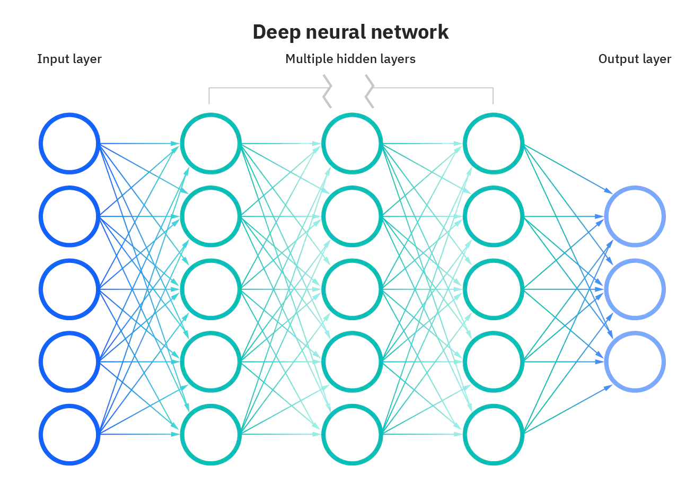

# Neural_Network_Charity_Analysis

## Overview of the analysis
The purpose of this analysis is to use a binary classifer model in order to indicate whether the apillication company will be successful if donated by the philanthropic organization named AlphabetSoup. 

Since this deep learning model contains more than 30,000 historical data, data preprocessing is required before compiling, training, and evaluating.

## Results
### Data Preprocessing
- Target variables  

  The target variable is the "IS_SUCCESSFUL" column, representing the binary past project result. "1" for "YES" and "0" for "NO".  

- Features variables include:
  - EIN and NAME—Identification columns
  - APPLICATION_TYPE—Alphabet Soup application type
  - AFFILIATION—Affiliated sector of industry  
  - CLASSIFICATION—Government organization classification  
  - USE_CASE—Use case for funding  
  - ORGANIZATION—Organization type  
  - STATUS—Active status  
  - INCOME_AMT—Income classification  
  - SPECIAL_CONSIDERATIONS—Special consideration for application  
  - ASK_AMT—Funding amount requested  
  - IS_SUCCESSFUL—Was the money used effectively

- Remove variables

  
  Drop the EIN and NAME columns while they are neither targets nor features. In shorts, they are non-beneficial to the model analysis. 

### Compiling, Training, and Evaluating the Model
- Neurons, Layers, and Activation functions selection

  The initial neuron network used with Relu activation has 35 neurons input, one output layer.The reason for the Relu method selection is that it is an excellent choice to handle complex data and reduce the possibility of overfitting and vanishing gradients. 

- Target and Result
    - The performance target is 75%, but the final has a short distance to the ideal result(72.6% accuracy).
    - **The First attemp** with a 56.4% loss and 72.2% accuracy 
    
    
    - **The second attempt** adds twice neurons of 80 in layer1 and 40 neurons in layer2. Both choose not a too big number to avoid overfitting, and twice the number is a good rule to explore—the result is approximately 56% loss and about 72.6% accuracy. Increase a little compared to the first attempt.

## Summary
 - From the analysis, we are not able to get the optimal accuracy of 75% because of the given times. However, we had the best score of 72.6% accuracy and 56.4% loss. Therefore, the recommendation is to reduce additional outliers and use different activation methods (e.g. tanh). 

- Also, we are figuring out a binary outcome, so it is better to consider the supervised learning model such as Random Forest, which could bring a faster result than a neural network.
